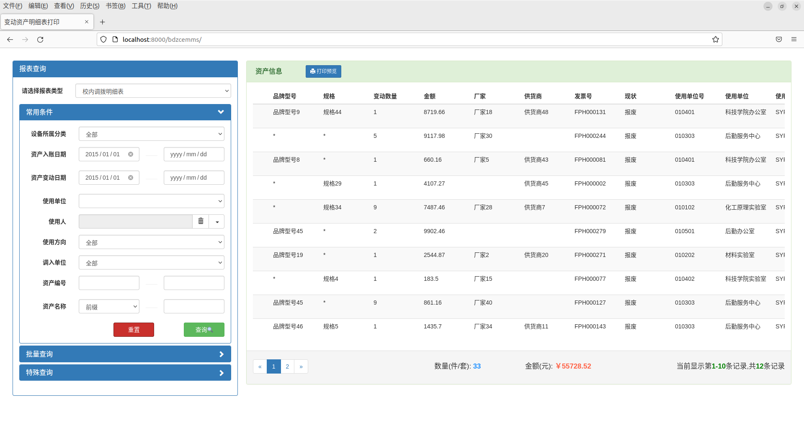
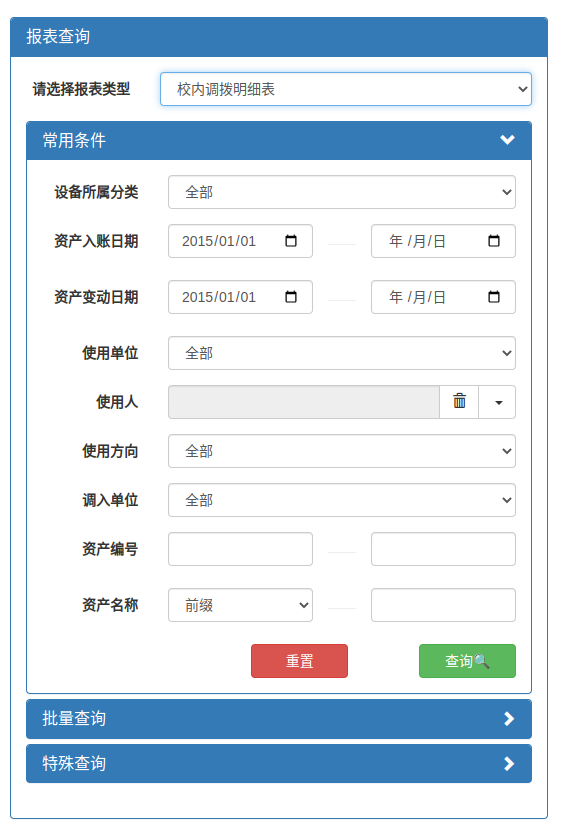
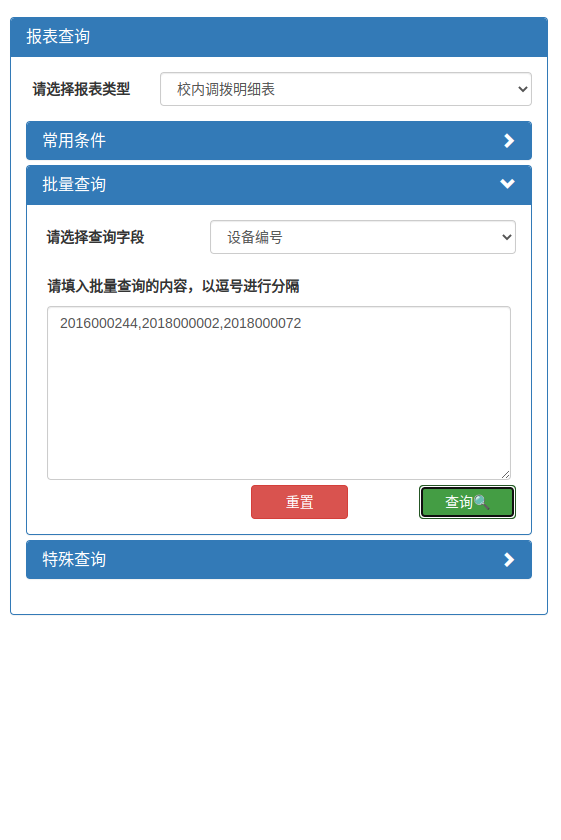
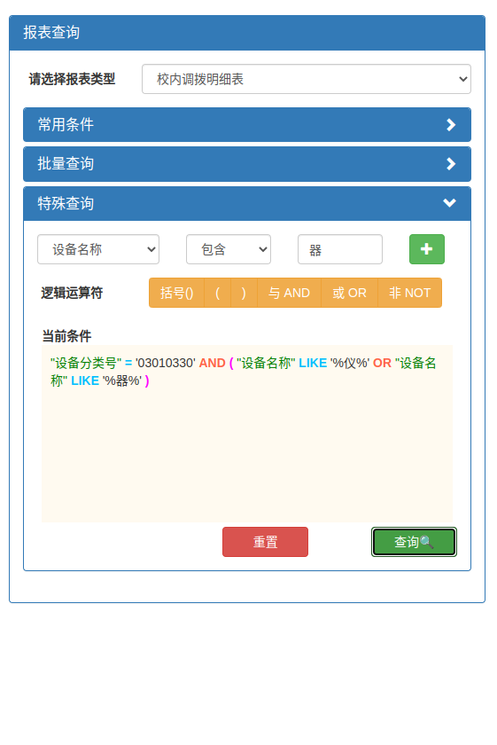
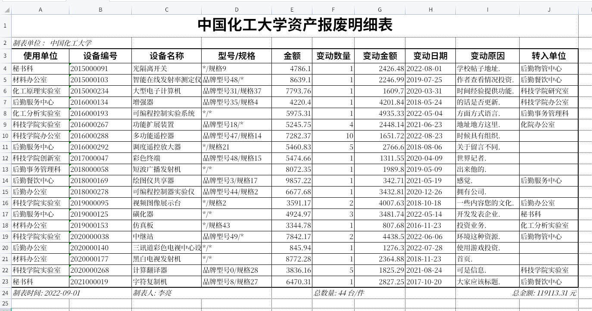

### 项目实现效果

整体页面分为左边的查询板块和右边的结果显示模块，结果进行了分页显示，并显示了统计信息

查询板块分为三个子模块，分别是常用条件查询，批量查询，和特殊查询

导出报表效果

### 操作说明

1. 在进入系统后，可先通过左边模块顶部下拉列表选择要打印的报表类型，选择之后会显示该种报表的所有数据

2. 之后根据自己需要的条件可选择常用条件查询、批量查询、以及特殊查询,这三种查询是独立，没有进行查询条件的组合

   (1) 条件查询

   ​     对于所有的下拉列表都可直接选择，其中使用人提供了过滤查询以及重置按钮，对于日期和资产编号需要提供完整的起始和终结值，对于资产名称，可选择前缀、包含、后缀三种模糊查询方式，点击查询显示结果，点击重置会将选项设置为默认值并清空输入

   (2) 批量查询

   ​    可通过下拉列表选择要批量查询的字段，在输入框内输入要查询的值并用逗号隔开，点击查询显示结果，点击重置清空输入

   (3) 特殊查询

   ​    可通过字段选择列表、比较方式选择列表、以及查询值输入栏构造要查询的条件，点+号将条件加入当前条件的游标后，可通过点击逻辑运算符按钮输入逻辑运算符对查询条件进行逻辑连接，点击查询显示结果，点击重置清空输入框

3. 在显示结果的标题栏中点击打印预览，导出数据为Excel

